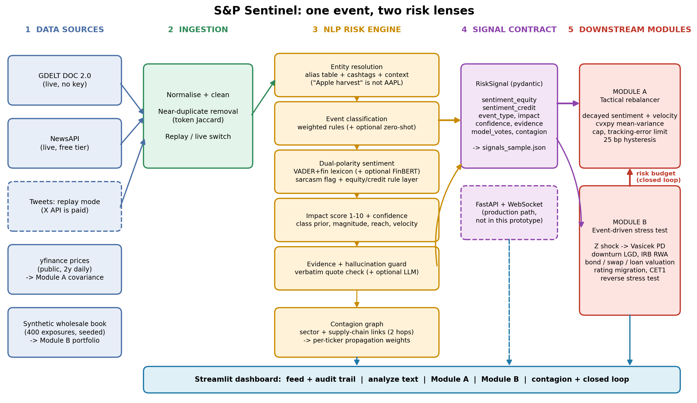

# S&P Sentinel: Unified Risk & Portfolio Analytics - S&P Global & Crisil Campus Hackathon

**Candidate Name:** Bhavya
**College Email ID:** bhavya035btcseai23@igdtuw.ac.in
**College / Campus:** Indira Gandhi Delhi Technical University for Women (IGDTUW), Delhi
**Demo Video Link:** [YouTube unlisted link]
**Slide Deck Link (if hosted externally):** Not hosted externally. See [docs/presentation.pdf](docs/presentation.pdf)

## 1. Project Overview / Problem Statement & Approach

Financial risk teams receive thousands of unstructured headlines and posts per hour, but portfolios and credit books consume structured numbers. This project builds a unified **AI/NLP Risk Engine** that turns text into machine-readable risk signals (sentiment score, event class, impact score), then feeds the *same* signals into both downstream modules: **Module A**, a tactical index rebalancer, and **Module B**, a strategic event-driven stress test of a wholesale credit book.

The approach rests on four ideas. (1) **Dual polarity**: every signal carries an equity sentiment and a separate credit sentiment, because a debt-funded buyback is good news for shareholders and bad news for creditors. (2) **Entity resolution and a contagion graph**: mentions resolve to tickers ("Apple harvest" is rejected as non-AAPL) and spread to related names through sector and supply-chain links. (3) **Basel-style stress chain**: the impact score drives a systematic-factor shock, which flows through a Vasicek conditional PD, downturn LGD, IRB capital, instrument valuation and rating migration. (4) **Closed loop and auditability**: Module B's capital consumption tightens Module A's optimiser, and every signal carries a verbatim evidence quote, model votes, a confidence score and a model version, with a guard that rejects ungrounded LLM claims.

## 2. Architecture & Tech Stack



- **Language / UI:** Python, Streamlit, Plotly
- **NLP:** VADER with a financial lexicon, rule-based event classifier and entity resolver, sarcasm heuristic, hallucination guard. Optional upgrades: FinBERT (`ProsusAI/finbert`), zero-shot classification (`facebook/bart-large-mnli`), LLM extraction via the Anthropic API
- **Optimisation / risk maths:** cvxpy, scikit-learn (Ledoit-Wolf covariance), SciPy, NumPy, pandas, NetworkX
- **Contracts:** pydantic `RiskSignal` schema, written to `data/signals_sample.json`

```
src/
  ingestion.py            replay/live loaders (GDELT, NewsAPI, tweet replay), clean, de-duplicate
  nlp_engine.py           entity resolution, event class, dual-polarity sentiment, impact, guard, evaluation
  contagion.py            sector + supply-chain propagation graph
  module_a_rebalancer.py  decayed sentiment, cvxpy optimiser, hysteresis
  module_b_stresstest.py  Vasicek PD, LGD, IRB, valuation, reverse stress, risk-budget bridge
  app.py                  Streamlit dashboard
  generate_data.py        deterministic synthetic data generator
data/                     all data used by the prototype
tests/test_core.py        12 unit tests
docs/                     presentation.pdf, architecture.png
```

## 3. Dataset Used

| File | Nature | Source |
|---|---|---|
| `data/sample_news.json` | 36 hand-labelled news and tweet items in 3 scenarios (Red Sea shipping, banking stress, mixed) | **Synthetic**, written by the author. Not real news; real tickers appear only for realism |
| `data/wholesale_portfolio.csv` | 400 wholesale exposures: loans, revolvers, fixed/floating bonds, swaps, FX forwards | **Synthetic**, seeded (`python src/generate_data.py`) |
| `data/prices.csv` | 2 years of daily adjusted closes for the 20-stock S&P 100 basket | **Public**, downloaded with `yfinance` |
| `data/signals_sample.json` | Engine output for the sample news | Generated by `python -m src.nlp_engine` |

Assumptions: X/Twitter's API is paid, so social posts run in **replay mode**; GDELT and NewsAPI live modes exist but the demo uses deterministic replay. Ratings, PDs, LGDs, shock sizes, CET1 levels and impact class priors are **illustrative**, not calibrated to CCAR/EBA or any institution. The Kaggle sentiment datasets and the Salad Money open-banking data were **not used**. No proprietary or client data was used.

## 4. Quickstart & Installation

Runtime: Python 3.12.4 on macOS

```bash
git clone https://github.com/bhavyayay/igdtuw-bhavya-hackathon.git
cd igdtuw-bhavya-hackathon
python -m venv venv
source venv/bin/activate
pip install -r requirements.txt
streamlit run src/app.py
```

The app opens at http://localhost:8501 and runs fully offline from `/data`. No API keys are needed. Pick a scenario in the sidebar, then use the tabs.

Optional:
```bash
pip install -r requirements-dev.txt
python -m pytest -q tests
python -m src.nlp_engine
python -m src.module_b_stresstest
python -m src.module_a_rebalancer --fetch-prices
pip install -r requirements-ml.txt
SENTINEL_USE_FINBERT=1 streamlit run src/app.py
```

## 5. Key Results & Domain Impact

**What it demonstrates**
- Text in, structured signal out: entity, ticker, equity and credit sentiment, event class, impact 1-10, confidence, evidence quote, contagion weights.
- Module A reweights a 20-stock basket every 30 minutes within a 15% cap and a 4% tracking-error limit, with a 25 bp no-trade band.
- Module B turns events with impact >= 7 and confidence >= 0.6 into a stress test with loss, change in expected loss, change in RWA, CET1 and rating migration, plus a reverse stress test.

**NLP engine on the labelled sample (35 items after de-duplication). This is a development set the rules were tuned on, not a generalisation estimate.**

| Metric | Value |
|---|---|
| Entity (ticker) accuracy | 1.00 |
| Event class accuracy / macro-F1 | 1.00 / 1.00 |
| Equity sentiment sign accuracy | 0.94 |
| Credit sentiment sign accuracy | 0.91 |
| Credit accuracy on 10 items where equity and credit disagree: dual polarity vs single-polarity baseline | 1.00 vs 0.20 |

**Module B on the Red Sea and banking-stress replays (illustrative shocks)**

| Event | Impact | Loss | Change in EL | Change in RWA | CET1 |
|---|---|---|---|---|---|
| Red Sea shipping halt | 9.2 | $185 mn | $80 mn | +$3.5 bn | 14.0% to 9.46% |
| Follow-on shipping story | 7.2 | $138 mn | $50 mn | +$2.6 bn | 14.0% to 10.45% |
| Bank CRE provisions (credit event) | 7.3 | $260 mn | $85 mn | +$4.5 bn | 14.0% to 8.41% |

Reverse stress: the book breaches its 10.5% CET1 minimum at an impact score of about 4.3 for a credit event, 6.0 for a macro event and 6.4 for a geopolitical event; a regulatory event does not breach it.

**Domain impact.** For a market-intelligence provider, entity-linked, explainable text signals with an evidence trail are directly consumable by screening and monitoring products. For a credit-risk and ratings house, mapping events to PD, LGD, rating migration and capital in the same vocabulary as Basel and rating methodologies shortens the path from a headline to a portfolio-level loss estimate.

**Limitations.** Rule-based layers were tuned on a small set, so held-out accuracy will be lower. The impact weights and class priors are not event-study calibrated. The contagion edges are hand-seeded, not learned. The IRB formula is simplified and stressed PDs are partially passed through to RWA (through-the-cycle assumption). Shock templates are not regulatory scenarios. The book and news are synthetic.

**AI assistance.** AI tools were used to help write and test code. Design choices, parameter calibration, and verification (12 unit tests, hand-labelled evaluation) were reviewed by the candidate.

## License

MIT, see [LICENSE](LICENSE).